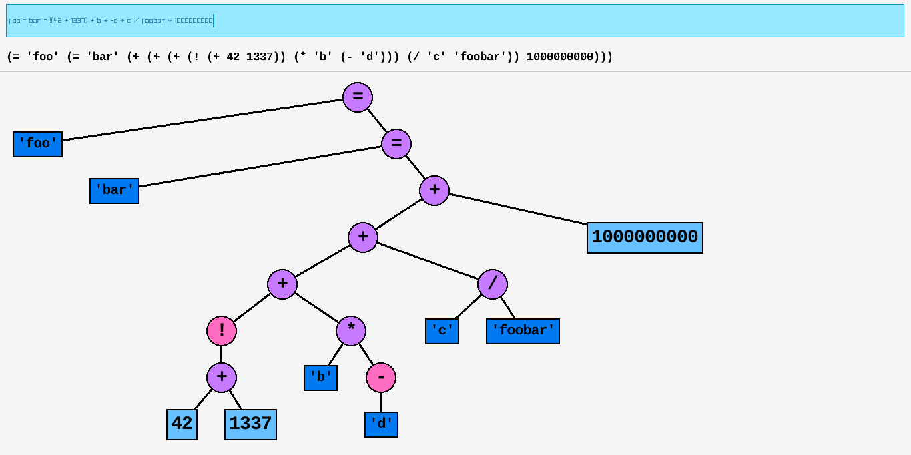

<div align=center>
  <picture>
    
  </picture>
  <h2>Pratt Parsing Visualization</h2>

  Visualizing the pratt parsing abstract syntax tree generation in real time with a colorful GUI.

  Powered by Zig + Raylib.
</div>

---

## Dependencies
* *Zig 0.15.1*

## Building and Running
```sh
zig build run
```

## Limitations
This is only a small demonstration of the Pratt Parsing algorithm, only the bare minimum will be included to achieve the educational purposes of the program.

* No floating point
* No ternaries (subject to change)
* No memory operators (like pointers, referencing and dereferencing, etc.)

## Operators
Currently, the following operators are available:

* **Special**: `';' (end of statement)` `'()' (precedence forcing)` `'{}' (expressions)`

* **Assignment**: `'=' (assignment)`

* **Basic arithmetic**: `'+' (sum)` `'-' (subtraction)` `'-' (negation)` `'*' (multiplication)` `'/' (division)`

* **Increment and Decrement**: `'++' (pre-increment)` `'++' (post-increment)` `'--' (pre-decrement)` `'--' (post-decrement)`

* **Boolean logic**: `'and' (boolean and)` `'or' (boolean or)` `'!' (boolean not)`

## Examples
Type these in the Text box, and don't forget the closing semicolon:

`foo = 42;`

`foo = bar = -(!a + (42 * 1337));`

`{foo = 1; bar = 2; baz = foo + bar;};`
